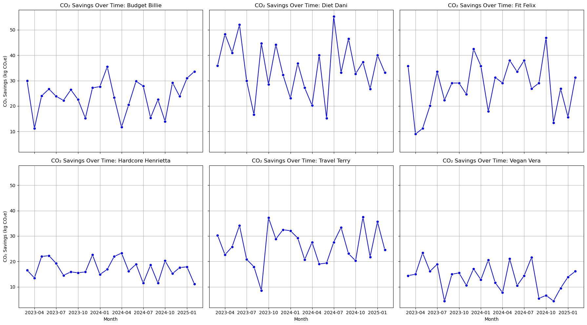
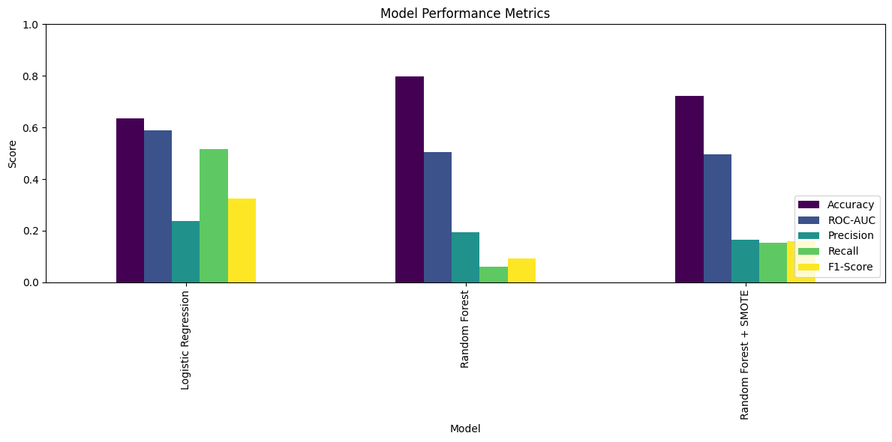

#### Table of Contents
- [Introduction](#introduction)
- [Problem](#problem)
- [Solution](#solution)
- [Limitations](#limitations)
- [Web Development](#web-development)
    - [Frontend](#frontend)
    - [Backend](#backend)
- [Data-Science](#data-science)
- [Deep-Learning](#deep-learning)
- [Deployment](#deployment)
- [Demos](#demos)
- [Conclusion](#conclusion)
- [Team](#team)

## Introduction

MyDailyImpact is an impact calculator that encourages users to eat more sustainably and compassionately by swapping animal-based meals for plant-based ones–without having to commit to a fully plant-based diet. Users can sign up and log each plant-based meal they eat and instantly see the impact that meal has on four key areas:  animals, CO2, water, and forestland saved. Users can consult their meal history and see their aggregated impact. Users can also use Planty, our AI-powered chatbot, for plant-based recipe recommendations.

This app was developed by web development (frontend and backend), data science, and deep learning students that took part in [TechLabs’](https://www.techlabs.org/) Winter Semester 2024/2025 #CodeAtHome remote bootcamp.

## Problem

The production and consumption of animal products contributes to the mass loss of animal lives and increases in global water usage, CO2 emissions, and forestland being destroyed.

By 2050, the world’s population is expected to exceed 10 billion people, requiring a global increase in food production by 70%, with greenhouse gas emissions expected to increase by 80% (Dent, 2020; University of British Columbia, 2016). The current levels of meat-consumption are simply unsustainable, not to mention the cruelty that is involved in the global animal agriculture industry. According to _Viva!_ (Vegetarians International Voice for Animals), vegans–people who do not eat any food derived from animals nor use products derived from animals–make up merely three percent of the global population (over 230 million people); _The Guardian_ has a smaller estimate of only one percent (799 million people) (Viva!, n.d.). There are simply not enough people deciding to give up animal products, despite the Earth’s wellbeing, and that of its farm animal inhabitants, being greatly affected by it.

(source Ritchie & Roser, 2021)

In 2017, the project’s team lead Vivian Sandler attended the Summer Youth Assembly, a multi-day conference, that took place at the United Nations Headquarters in New York City. While listening to speeches about how we can make the world a more sustainable place aligned with the 17 Sustainable Development Goals, she was surprised by something:  a simple action that can be done by all people on a daily basis, and could have profound effects on 6 different SDGs (#2 Zero Hunger, #3 Good Health and Well-Being, #12 Responsible Consumption and Production, #13 Climate Action, #14 Life Below Water, and #15 Life on Land) was not mentioned once–**reducing one’s consumption of animal products**.

## Solution

Vivian, along with her TechLabs teammates, agree that something can be done about the world’s population’s unsustainable meat consumption; people can be encouraged to make changes to their diet **without having to commit to being 100% plant-based** or vegan. This approach is much more attractive to those who are unwilling to give up animal products completely. MyDailyImpact is different from other “impact calculator” apps because it can be used by those who don’t follow a strictly vegan lifestyle (for the other vegan calculators, one must be fully vegan to find out their impact). We want to show people through our app that even small changes in the way they eat can have a big impact on the Earth and its farm animal inhabitants, making our app the first of its kind. By showing the impact users have, even if they do not identify as fully vegan or plant-based, they will feel instant gratification which is likely to keep them on their flexitarian (a person who strives to eat plant-based but still eats meat, fish, and animal-derived products) journey.

Our app allows people to sign up, login, edit their profile, input their plant-based meals, view their meal history and delete entries, and see their impact in the four categories (animals, water, CO2, and forestland saved). We also have an AI RAG chatbot that will be described in more detail below.

## Limitations

Due to time constraints, the team:

- did not include measurements of grain saved by swapping out meat-based meals for plant-based ones
- were unable to differentiate impact metrics by country–a goal of ours given that meat-consumption patterns vary by continent

Also, our intent was to integrate the AI RAG (retrieval-augmented generation) chatbot to the web app using FastAPI, however, challenges were encountered, and given our time restraint, we were not able to include the chatbot that allows users to ask for plant-based recipe suggestions. We kept the navigation bar link to the recipe bot and the page still renders when the link is clicked, however, the chatbot is not functioning. It is the team’s goal to get the RAG integrated soon after the bootcamp is finished and before deploying the app. If interested in seeing how a less advanced, but still functioning and integrated using FastAPI chatbot looks like in our app, please see the branch _old-version-chatbot_ and follow the instructions for installation and viewing.

Finally, we would like to inform users that our impact metrics, while being obtained using real data and calculations, are estimates. There are various ways to calculate, for example, how many animals are saved by not consuming animal products. We went with the calculation that we believed to be the most accurate, while considering our time constraints (as was mentioned above, we were unable to show different metrics for each country). Nevertheless, we believe these estimations to be a good measure of one’s impact, but they remain as estimations and should be understood as such by our users.

## Web Development

The Web Development team consisted of frontend and backend team members who ensured the app would provide a delightful and smooth UI experience with authentication and useful functionalities.

### Frontend

#### UX/UI Responsibilities
With the absence of a UX team for this project, the frontend team took on the task of designing the app. We decided to sketch wireframes of our predicted pages in Microsoft Paint, which were posted on a Miro board along with other ideas for our UI library (logo ideas, graphics that could be used in the app). We then moved on to creating an UX prototype of the app in Figma. We thought it would be better for orientation in implementation to have concrete examples for how the app should look and how it would function. The frontend team members used their own ideas to create a design from scratch which reflects the spirit of the app. For example, the color scheme is influenced by Earthy tones, like water and plants, and the navbar header has an herbal feel (flower with leaves under the sky). We implemented a design which splits the pages – where useful – horizontally into two units (left-side component and right-side component). When decreasing the screen size, the splitting changes to column orientation, and once reaching mobile screen sizes, what was formerly the left-side components is set to display: none. To be able to respond quickly and with little effort to design changes, we worked with components, properties and global variables in Figma.

Throughout the making of this app, the design changed slightly for various reasons–though most times we adapted when we believed the app could be more user-friendly. The prototype was a useful and helpful basis for envisioning the app, for discussing design options, and testing proposals.

Overview of our Figma project

One of our original wireframes

Link to our [Figma project](https://www.figma.com/design/I2vOtpjWD5j5rK6xvlTpKc/MyDailyImpact?node-id=0-1&t=LKLUXXBgkZMK387W-1).

Link to our [Miro Board UI Library Brainstorm](https://miro.com/app/board/uXjVL1DhiZw=/).

#### From Design to Implementation: React Components

After creating the wireframes and prototypes of the different pages for our app, the frontend team moved on to creating a React project and used Vite as the web building tool for React. By implementing nested React components we turned those designs into reality. The team started by creating a skeleton structure that most of our pages would follow – a left-right division (see Content_LR.jsx inside the path mdi-react/src/components/core/ContentLR), in which the left-side component would contain an image and the right-side would contain the page’s text or input content. This skeleton component would be used for nearly all of our pages. When used, the left component would remain the same – an image we created in Canva of a globe with trees around its circumference and farm animals on the different continents – while the content on the right would be different depending on the page. Our pages include:

- Home
- About
- Recipe Bot
- Login
- Sign Up
- Dashboard
- Log a Meal
- Meal History
- Profile
- Contact
- Imprint
- Privacy

All of these page components were individually exported in their respective files. They were then imported into our main JSX (JavaScript Extension) file, _App.jsx_. We used react-router-dom, specifically Route and Routes here. In our header component file, we utilized NavLink from react-router-dom to seamlessly link to the pages in our navigation bars without refreshing. We have one navigation bar for when a user is logged in, and another for when the user is not logged in; the correct header renders based on if the user is authenticated from the backend.

#### Styling with SCSS

As was mentioned earlier, the frontend team was in charge of the UX/UI part of this project, given there wasn’t a UX track this semester at TechLabs. Our designs were made from scratch, which is what made us decide to use SCSS as opposed to a framework (like Tailwind CSS); we enjoyed the high level of flexibility and customization SCSS provides. We found this to be an exciting, albeit time consuming process. For precise component styling we used SCSS modules, located in the corresponding page folder, and for repetitive styling global SCSS files, located in an top-level styles folder. To implement our design ideas we made extensive use of grid and flexbox partly nested several times.

#### API Integration

Once the pages and the components that made them were practically all created, the frontend team moved on to API integration with the backend and deep learning teams.

To have the profile page render with user information that was provided when a user signed up, we used the GET API method to fetch user data and display it on the page. We then used the PUT API method to allow users to edit their profile and change their password. We consulted the Postman documentation provided by the backend to access these endpoints.

When integrating the first version of the deep learning team’s chatbot, who we named “Planty”, we used FastAPI integration. This version of the chatbot can be seen in the branch _old-version-chatbot_. Once the correct API endpoints matched the FastAPI backend, we were able to create a chatbot component that would

- Initialize conversation on component mount
- Handle message sending and receiving
- Show loading states
- Handle errors gracefully
- Add a welcome message

With this functionality, users could tell “Planty” what ingredients they have on hand and the chatbot will respond with plant-based recipe recommendations.

We were unfortunately unable to integrate the latest version of the RAG chatbot to the application due to time restraints and prioritizing our individual track requirements. We plan, however, to have the RAG version of the chatbot integrated sometime later this month (March 2025).

#### Media Queries and Responsiveness

Finally, the frontend team found itself spending time on ensuring the app was responsive. We utilized media queries, in which adjustments were made to the page components that made for pleasant UX/UI across all screen sizes. For our smaller screen sizes (mobile), we used React bootstrap to create a menu dropdown that replaces our “steam and leaves” styled navigation bar. We used various media queries, and different ones for different pages where we saw breakpoints and a need for the layout to be adjusted.

### Backend
#### Authentication & Security
We successfully implemented JWT token-based user authentication as our first milestone, providing secure access control to the application's features and data. This foundation ensures robust protection of user information and system resources.
#### Database & Server Architecture
We established MongoDB as our primary data store with Express serving as the API endpoint server, creating a flexible and scalable backend infrastructure. This architecture supports our growing feature set while maintaining performance.
#### User Management
The initial user model included essential fields: first name, last name, email, birthday, and password. As requirements evolved, we expanded the schema to incorporate gender and country data, enhancing user profiling capabilities. We developed a dedicated API for country selection to streamline the sign-up process.
#### API Development
Starting with two core endpoints supporting essential functionality, we systematically expanded our API to provide:
- Comprehensive input validation to ensure data integrity and prevent security vulnerabilities
- Robust error handling, providing clear feedback and maintaining application stability
- Complete CRUD operations for user data management
- A dedicated collection with full CRUD support for meal logging
- Environmental impact calculation endpoints (two specialized endpoints)
#### Supporting Services
We deployed a Docker container running Qdrant vector database to support the deep learning team's requirements, enabling similarity searches and advanced data processing.
#### Quality Assurance & Documentation
All API endpoints underwent thorough testing using Postman to verify functionality and performance. Comprehensive API documentation was created and is available at: https://documenter.getpostman.com/view/26399217/2sAYX6p2Qq#intro

## Data-Science

Our first goal was to develop a **scoring system to make users’ impact measurable**. The impact per category per meal was calculated based on open-source data from statistic bureaus and research papers.
Ourworldindata.org was particularly helpful, as it contained numerous datasets from the Food and Agriculture Organisation of the United Nations (FAO) that were up-to-date and easy to compare. When calculating the number of animal lives saved, for example, the meat consumption of different countries could be compared and included in the calculation, as different eating habits and social circumstances also determine the amount of meat consumed.

At the same time, some weaknesses in integrating this data into the app were also recognised.
Apart from technical aspects (as the integration was not part of our learning track), there was also the question of the extent to which splitting farm animals into different types of meat would not make the result too fragmented to be visualised in the app. Therefore, this was not done and only the proportion of a generalised ‘land animal’ was visualised.

The second goal for the data science team was to use machine learning to make predictions.
The biggest challenge here was to have a suitable dataset, as the app is not yet in use and no real user data is available. After various attempts to create dummy data ourselves, our mentor Zubin John created a dataset based on various criteria which we used as an initial starting point for our analyses.

The synthetic user data includes time series of user logs for 6 different users. Some visualization of the user data is made to help us understand the data.

Total meal logged per user:

CO2 Savings over time per user:

Geographic Distribution of Meal Activities:

The following predictions were made based on the synthetic user data:

- **Churn prediction/Analysis and prediction of user behaviour in relation to activity**
- **Analysis and prediction of carbon footprint in total and for each person**

The detailed analyses are available in the Data Science folder in our Git Repository.

Here is a brief summary:

**Churn prediction**: As every individual impact counts towards strengthening the environment, recognising whether a user will use the app in the future or leave it is hugely important. With machine learning predictions based on user behaviour and other parameters, predictive measures could be taken to further motivate the users and prevent them from leaving. A marketing team could, for example, use these predictions to send motivational emails or push messages to users.

To develop model, as a step of feature selection, the correlation of the features is analyzed:

Then, logistic regression and random forest models were used to determine the probability of a churn based on the user's inactivity. Multiple performance metrics are checked for each of the models.

**Analysis of carbon footprint**: This analysis demonstrates the power of data-driven forecasting in evaluating the CO₂ impact of shifting from meat-based meals to plant-based alternatives. By applying time-series models to historical CO₂ savings data, we evaluated different forecasting approaches, and selected the most accurate models for both overall savings and individual user contributions. By extending the forecast into 2025, we gain valuable insights into how CO₂ savings might evolve over time. These predictions could encourage the users to change more meals and maximize carbon footprint reductions.
ARIMA and XGBoot Regression were chosen for the carbon savings prediction. Initially, SARIMAX (Seasonal ARIMA with Exogenous Variables) was considered, but the Augmented Dickey-Fuller (ADF) test confirmed that the time series is stationary (i.e., no significant trend or seasonality). SARIMAX is most useful for non-stationary, seasonal time series, making it unnecessary for this dataset.
The best-performing model was selected based on Mean Absolute Error (MAE), Mean Squared Error (MSE), and RMSE. Using this model, an extended forecast for 2025 was generated:

Due to the synthetic and very unbalanced data set, the results are exemplary, and with a view to the future, further valuable insights can certainly be gained with real data.

## Deep-Learning

### Overview
We developed a plant-based recipe generator that combines retrieval-augmented generation (RAG) with a custom neural network reranker to provide high-quality, personalized vegan recipes.
This project showcases our expertise in natural language processing, machine learning, and data engineering.

### Key Components
#### Data Processing and Preparation
- Pre-processed a dataset of 500,000+ omnivore recipes from Food.com into a specialized dataset of 16,000+ vegan recipes and reviews for them
- Implemented comprehensive filtering mechanisms to ensure all animal products were excluded
- Created robust data preprocessing pipelines to normalize text, clean ingredients, and structure recipe information

#### Retrieval-Augmented Generation (RAG) System
- Built a conversational system leveraging the Mistral LLM for natural language understanding and recipe generation
- Implemented vector-based recipe storage and retrieval using Qdrant database
- Designed custom query rephrasing to effectively match user requests with relevant recipes
- Integrated conversation history to maintain context throughout user interactions

#### Custom Neural Network Reranker
- Implemented a BERT-based embedding system to capture semantic relationships between queries and recipes
- Developed a neural network reranker with a three fully connected layers and ReLU activation that processes query and document embeddings to rank the documents based on their relevance to the query
- Trained neural networks using cosine similarity scores as ground truth on 16,000 metadata samples to improve the similarity score, which demonstrated consistent decrease in loss during training and validation
- Implemented efficient batch processing and evaluation metrics to optimize model performance

### Integration with Main Application
- Seamlessly integrated with the frontend through a robust API architecture
- Queries processed through our backend pipeline retrieve and rank relevant documents before generating personalized responses
- Designed for natural conversational flow, allowing users to refine their requests and receive contextually relevant suggestions

### Technologies Used
- Language: Python
- App Integration: FastAPI
- RAG Pipeline:
- Retrieval and Augmentation: Haystack
- Natural Language Understanding and Response Generation: Mistral LLM
- Recipe retrieval: Qdrant vector database
- Embeddings: DistilBERT-base-uncased
- Reranker:
- Neural Network model: PyTorch
- Semantic Ranking Optimization: Custom similarity scoring

This collaborative project demonstrates our ability to integrate modern NLP techniques with custom machine learning models to solve a practical problem of generating personalized vegan recipes, which can be implemented in such domains as as recipe recommendation systems, health and wellness apps, dietary management platforms, or culinary AI assistants.

## Deployment

Due to time constraints and being unable to fully integrate the RAG chatbot developed by the deep learning team into the app, the team is holding off on deployment until this has been fixed and the advanced chatbot is integrated. We anticipate having the app deployed by the end of March 2025.

## Demos

App: https://drive.google.com/file/d/1fzXw7727m7eS1qdScomGzaXF_Ih1CL3d/view?usp=sharing

AI chatbot: https://drive.google.com/file/d/1cSGiq3ByMm8vgTVGnIvWuB8nh9-nnmAY/view?usp=sharing

## Conclusion

Despite some challenges during the last 10 weeks, the MyDailyImpact team used the knowledge they had acquired as students of the TechLabs #CodeAtHome remote bootcamp–studying web development, data science, and deep learning–to create a unique, user-friendly, and sustainability encouraging app that we are excited to deploy. We hope users will find themselves enjoying eating more plant-based meals, and helping save the world while they’re at it.

## Team
- DL: Kate Kozelkova, E. Prossinger
- DS: Menglan Liu, Vanessa Türker, Anna von Bank
- WD (FE): Vivian Sandler, Christine Stockert
- WD (BE): Tomislav Varga

Mentors:
- Rashmi D'Souza
- Amir Kahmseh

## References

Dent, M. (2020). “The meat industry is unsustainable.” IDTechEx. Available online at: https://www.idtechex.com/en/research-article/the-meat-industry-is-unsustainable/20231.

Ritchie, H. & Roser, M. (2021). “Environmental Impacts of Food Production.” Our World in Data. Available online at:  https://ourworldindata.org/environmental-impacts-of-food.

University of British Columbia (2016). “Environmental impact of meat consumption.” Open Case Studies. Available online at:  https://cases.open.ubc.ca/environmental-impact-of-meat-consumption/#:~:text=Specifically%2C%20livestock%20feed%20and%20meat,responsible%20for%2010%25%20greenhouse%20emission.

Viva! (2025). “Statistics About Veganism.” Available online at: https://viva.org.uk/lifestyle/statistics-about-veganism/#:~:text=It%20is%20difficult%20to%20find,people%20(one%20per%20cent).
