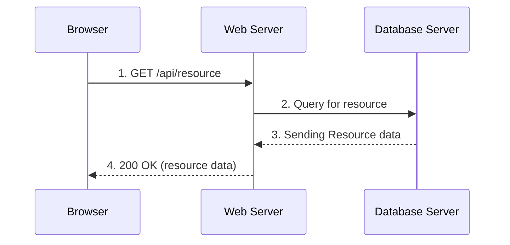
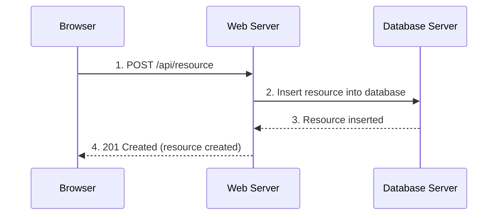
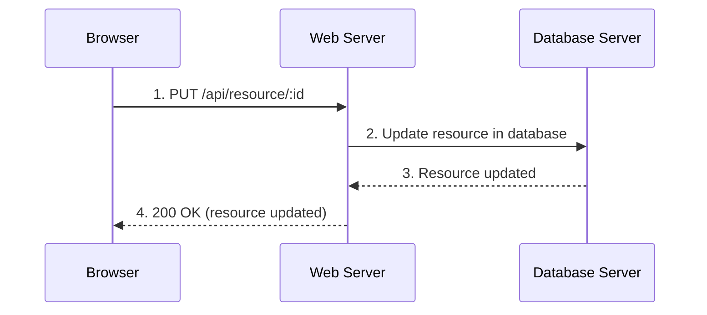
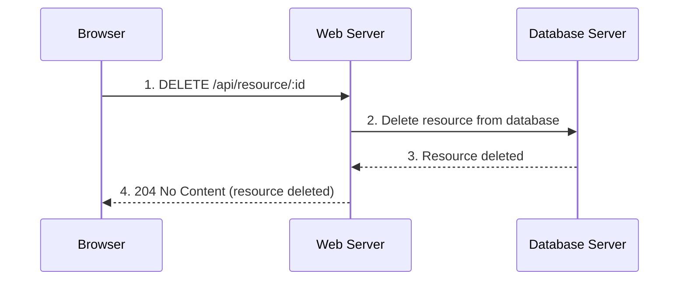

## Introduction
This repository contains example code that shows how you perform CRUD operations using Noode.js, Express.js and MongoDB in the backend and React in the frontend.

Below you can see the sequence diagrams that show how the frontend and backend communicate with each other to perform CRUD operations.

## HTTP GET Request


1. The browser sends a GET request to the web server to retrieve a specific resource.  
2. The web server queries the database server to fetch the requested resource data.  
3. The database server responds to the web server with the requested resource data.  
4. The web server sends a 200 OK response along with the resource data back to the browser.  

## HTTP POST Request


1. The browser sends a POST request to the web server to create a new resource.
2. The web server inserts the resource into the database server.
3. The database server responds to the web server that the resource has been successfully inserted.
4. The web server sends a 201 Created response back to the browser indicating that the resource has been created.

## HTTP PUT Request


1. The browser sends a PUT request to the web server to update an existing resource.
2. The web server updates the resource in the database server.
3. The database server responds to the web server that the resource has been successfully updated.
4. The web server sends a 200 OK response back to the browser indicating that the resource has been updated.

## HTTP DELETE Request


1. The browser sends a DELETE request to the web server to delete an existing resource.
2. The web server deletes the resource from the database server.
3. The database server responds to the web server that the resource has been successfully deleted.
4. The web server sends a 204 No Content response back to the browser indicating that the resource has been deleted.

## How to run the example code
Before you run the example code, make sure you have the .env file in the backend directory.

1. Checkout to the branch crud-example-code and cd to the crud-example-code directory
```bash
git checkout crud-example-code
cd crud-example-code
```
2. Install the dependencies
```bash
cd backend
npm install
cd ..
cd frontend
npm install
```
3. Start the backend server
```bash
cd ../backend
npm run dev
```
4. Start the frontend server from a new terminal window and cd to the frontend directory
```bash
cd frontend
npm run dev
```
5. Open your browser and go to http://localhost:5173 to see the application running.
